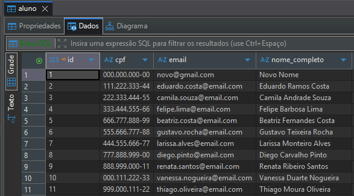
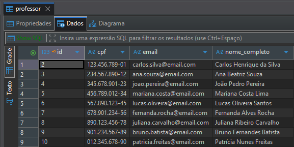

# 📚 API Aluno Professor

> API REST para gerenciamento de alunos e professores, desenvolvida com **Java 21** e **Spring Boot**.

---

## 📋 Índice

- [Sobre o Projeto](#-sobre-o-projeto)
- [Tecnologias](#-tecnologias)
- [Arquitetura](#-arquitetura)
- [Pré-requisitos](#-pré-requisitos)
- [Como Executar](#-como-executar)
- [Endpoints](#-endpoints)
- [Banco de Dados](#-banco-de-dados)
- [Autor](#-autor)

---

## 💡 Sobre o Projeto

Esta API fornece operações CRUD completas para o gerenciamento de **alunos** e **professores** em um ambiente educacional. O projeto foi construído seguindo boas práticas de desenvolvimento com Spring Boot, utilizando uma arquitetura em camadas bem definida e persistência de dados com PostgreSQL.

---

## 🛠️ Tecnologias

| Tecnologia | Versão | Finalidade |
|---|---|---|
| [Java](https://www.oracle.com/java/) | 21 | Linguagem principal |
| [Spring Boot](https://spring.io/projects/spring-boot) | — | Framework para criação da API REST |
| [Spring Data JPA](https://spring.io/projects/spring-data-jpa) | — | Abstração do acesso ao banco de dados |
| [Hibernate](https://hibernate.org/) | — | ORM (Object-Relational Mapping) |
| [PostgreSQL](https://www.postgresql.org/) | — | Banco de dados relacional |
| [Maven](https://maven.apache.org/) | — | Gerenciamento de dependências e build |

---

## 🏗️ Arquitetura

O projeto segue o padrão de **arquitetura em camadas (Layered Architecture)**:

```
src/
└── main/
    └── java/
        └── com/example/api/
            ├── controller/    # Recebe e responde às requisições HTTP
            ├── service/       # Contém as regras de negócio
            ├── repository/    # Interface com o banco de dados (Spring Data JPA)
            └── model/         # Entidades mapeadas para o banco (Aluno, Professor)
```

**Fluxo de uma requisição:**

```
Cliente HTTP
    │
    ▼
Controller  →  Service  →  Repository  →  Banco de Dados (PostgreSQL)
    │              │
    │         (regras de
    │          negócio)
    ▼
Resposta JSON
```

---

## ✅ Pré-requisitos

Antes de iniciar, certifique-se de ter instalado em sua máquina:

- [Java 21+](https://www.oracle.com/java/technologies/downloads/)
- [Maven 3.8+](https://maven.apache.org/download.cgi)
- [PostgreSQL 14+](https://www.postgresql.org/download/)
- (Opcional) [DBeaver](https://dbeaver.io/) ou outro cliente SQL para visualizar o banco

---

## ▶️ Como Executar

### 1. Clone o repositório

```bash
git clone https://github.com/VictorDGadelha/api_aluno_professor.git
cd api_aluno_professor
```

### 2. Configure o banco de dados

Acesse o PostgreSQL e crie o banco:

```sql
CREATE DATABASE projeto_javap2;
```

### 3. Configure o `application.properties`

Edite o arquivo em `src/main/resources/application.properties` com suas credenciais:

```properties
spring.datasource.url=jdbc:postgresql://localhost:5432/projeto_javap2
spring.datasource.username=seu_usuario
spring.datasource.password=sua_senha

spring.jpa.hibernate.ddl-auto=update
spring.jpa.show-sql=true
spring.jpa.properties.hibernate.dialect=org.hibernate.dialect.PostgreSQLDialect
```

### 4. Execute a aplicação

```bash
mvn spring-boot:run
```

A API estará disponível em: `http://localhost:8080`

---

## 📡 Endpoints

### 👨‍🎓 Aluno — `/alunos`

| Método | Rota | Descrição | Body (JSON) |
|--------|------|-----------|-------------|
| `POST` | `/alunos` | Criar aluno | `{ "nome": "...", "email": "...", "cpf": "..." }` |
| `GET` | `/alunos` | Listar todos os alunos | — |
| `GET` | `/alunos/{id}` | Buscar aluno por ID | — |
| `PUT` | `/alunos/{id}` | Atualizar aluno | `{ "nome": "...", "email": "...", "cpf": "..." }` |
| `DELETE` | `/alunos/{id}` | Deletar aluno | — |

**Exemplo de requisição — criar aluno:**

```http
POST /alunos
Content-Type: application/json

{
  "nome": "João Silva",
  "email": "joao.silva@email.com",
  "cpf": "123.456.789-00"
}
```

**Exemplo de resposta:**

```json
{
  "id": 1,
  "nome": "João Silva",
  "email": "joao.silva@email.com",
  "cpf": "123.456.789-00"
}
```

---

### 👨‍🏫 Professor — `/professores`

| Método | Rota | Descrição | Body (JSON) |
|--------|------|-----------|-------------|
| `POST` | `/professores` | Criar professor | `{ "nome": "...", "email": "...", "cpf": "..." }` |
| `GET` | `/professores` | Listar todos os professores | — |
| `GET` | `/professores/{id}` | Buscar professor por ID | — |
| `PUT` | `/professores/{id}` | Atualizar professor | `{ "nome": "...", "email": "...", "cpf": "..." }` |
| `DELETE` | `/professores/{id}` | Deletar professor | — |

**Exemplo de requisição — criar professor:**

```http
POST /professores
Content-Type: application/json

{
  "nome": "Maria Oliveira",
  "email": "maria.oliveira@escola.com",
  "cpf": "987.654.321-00"
}
```

---

## 🗄️ Banco de Dados

As tabelas são geradas automaticamente pelo Hibernate na primeira execução.

**Tabela `aluno`:**



**Tabela `professor`:**



---

## 👨‍💻 Autor

**Victor Gadelha**

[](https://github.com/VictorDGadelha)

---

> Projeto desenvolvido para fins acadêmicos.
